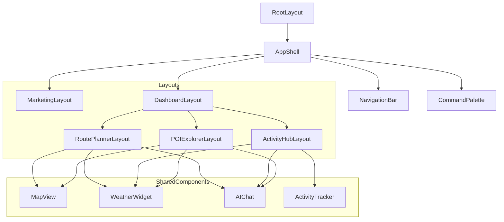

# Routopia Page Structure

## App Structure Overview

```
src/app/
├── (marketing)/           # Marketing/Public Pages Group
│   ├── layout.tsx        # Marketing layout with navigation
│   └── page.tsx          # Landing page
├── (dashboard)/          # Authenticated Pages Group
│   ├── layout.tsx        # Dashboard layout with auth check
│   ├── page.tsx          # Dashboard home
│   ├── route-planner/    # Route Planning Feature
│   │   ├── layout.tsx    # Route planner layout
│   │   └── page.tsx      # Route planner page
│   ├── activity-hub/     # Activity Tracking Feature
│   │   ├── layout.tsx    # Activity hub layout
│   │   └── page.tsx      # Activity hub page
│   └── poi-explorer/     # POI Exploration Feature
│       ├── layout.tsx    # POI explorer layout
│       └── page.tsx      # POI explorer page
└── api/                  # API Routes
    ├── auth/             # Authentication endpoints
    ├── activities/       # Activity tracking endpoints
    ├── routes/           # Route management endpoints
    └── weather/          # Weather data endpoints

```

## Component Hierarchy



## Page Components

### Marketing Pages
- **Landing Page** (`/`)
  - Features showcase
  - Sign-up modal
  - Hero section with video background

### Dashboard Pages
- **Dashboard Home** (`/dashboard`)
  - Activity summary
  - Recent routes
  - Weather overview

- **Route Planner** (`/dashboard/route-planner`)
  - Interactive map
  - Weather integration
  - AI route suggestions

- **Activity Hub** (`/dashboard/activity-hub`)
  - Activity tracking
  - Progress visualization
  - Social features

- **POI Explorer** (`/dashboard/poi-explorer`)
  - Points of interest map
  - Location details
  - Weather conditions

## Shared Components

### Layout Components
- **AppShell**
  - Global navigation
  - Command palette
  - Theme provider
  - Auth state management

- **NavigationBar**
  - Main navigation
  - User menu
  - Search bar

### Feature Components
- **MapView**
  - Mapbox integration
  - Custom controls
  - Route visualization

- **WeatherWidget**
  - Current conditions
  - Forecast display
  - Weather alerts

- **AIChat**
  - Route suggestions
  - Activity recommendations
  - Natural language interface

- **ActivityTracker**
  - Activity list
  - Stats visualization
  - Progress tracking

## State Management

### Global State
- Theme preferences
- User authentication
- Navigation state
- Command palette state

### Feature State
- Route planning state
- Activity tracking data
- POI exploration state
- Weather data cache

## API Integration

### Authentication
- NextAuth.js integration
- Google OAuth
- Session management

### Data Endpoints
- `/api/activities/*` - Activity tracking
- `/api/routes/*` - Route management
- `/api/weather/*` - Weather data
- `/api/locations/*` - POI data

## Style Organization

```
src/styles/
├── base/              # Base styles
├── components/        # Component styles
│   ├── layout/       # Layout components
│   ├── shared/       # Shared components
│   └── features/     # Feature components
├── theme/            # Theme configuration
└── utils/            # Utility styles
```

## Development Guidelines

### Adding New Pages
1. Create page in appropriate route group
2. Add corresponding layout if needed
3. Update navigation
4. Add required API routes

### Adding New Components
1. Create in appropriate directory
2. Add corresponding styles
3. Update component exports
4. Add to documentation

### Style Changes
1. Update theme configuration
2. Modify component styles
3. Update style documentation
4. Test in all themes 