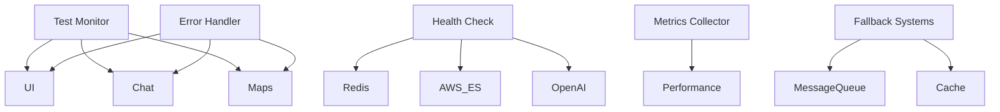

# Architecture Enhancement Recommendations

## 1. Testing Infrastructure Additions
```typescript
interface TestingInfrastructure {
  monitoring: {
    components: {
      healthCheck: 'SystemHealthMonitor',
      apiMetrics: 'APIMetricsCollector',
      performanceTracker: 'PerformanceMonitor',
      errorLogger: 'ErrorTrackingSystem'
    },
    connections: [
      'Redis health monitoring',
      'AWS ElastiCache status',
      'Database connection monitoring',
      'API service status'
    ]
  }
}
```

## 2. Error Handling Enhancements
```typescript
interface ErrorHandling {
  failover: {
    messageQueue: {
      primary: 'Redis',
      fallback: 'In-memory queue'
    },
    cache: {
      primary: 'AWS ElastiCache',
      fallback: 'Local cache'
    }
  },
  recovery: {
    strategies: [
      'Auto-retry mechanism',
      'Circuit breaker pattern',
      'Graceful degradation',
      'State recovery'
    ]
  }
}
```

## 3. New Components to Add


## 4. Connection Refinements
```typescript
interface ConnectionRefinements {
  stateManagement: {
    additions: [
      'Error state handling',
      'Recovery mechanisms',
      'State persistence',
      'Sync management'
    ]
  },
  caching: {
    improvements: [
      'Multi-level caching',
      'Cache invalidation',
      'Cache warming',
      'Cache monitoring'
    ]
  }
}
```

## Key Changes Summary:

1. Add Testing Layer:
   - System health monitoring
   - Performance metrics collection
   - API status tracking
   - Error logging system

2. Enhance Error Handling:
   - Fallback systems
   - Recovery mechanisms
   - Circuit breakers
   - State recovery

3. Improve State Management:
   - Better error state handling
   - State recovery mechanisms
   - Improved synchronization
   - Persistent state backup

4. Cache Optimization:
   - Enhanced cache strategy
   - Better invalidation
   - Monitoring tools
   - Fallback mechanisms

Would you like me to:
1. Detail specific component implementations?
2. Create error handling flows?
3. Define testing metrics?
4. Develop monitoring strategies?

These adjustments will make your system more resilient during testing and easier to debug when issues arise.